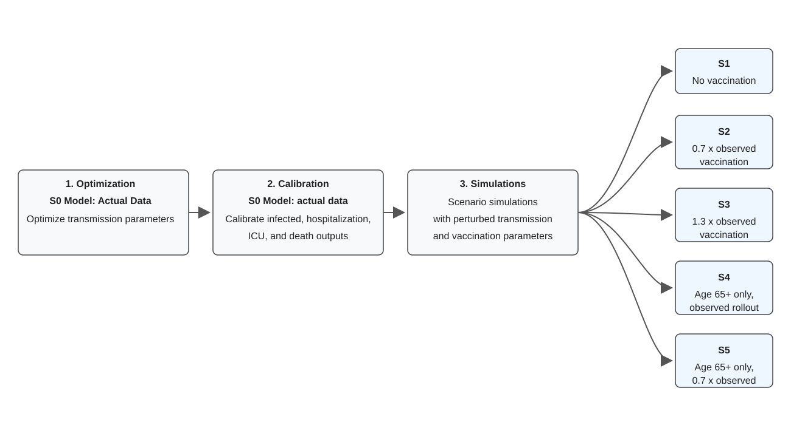
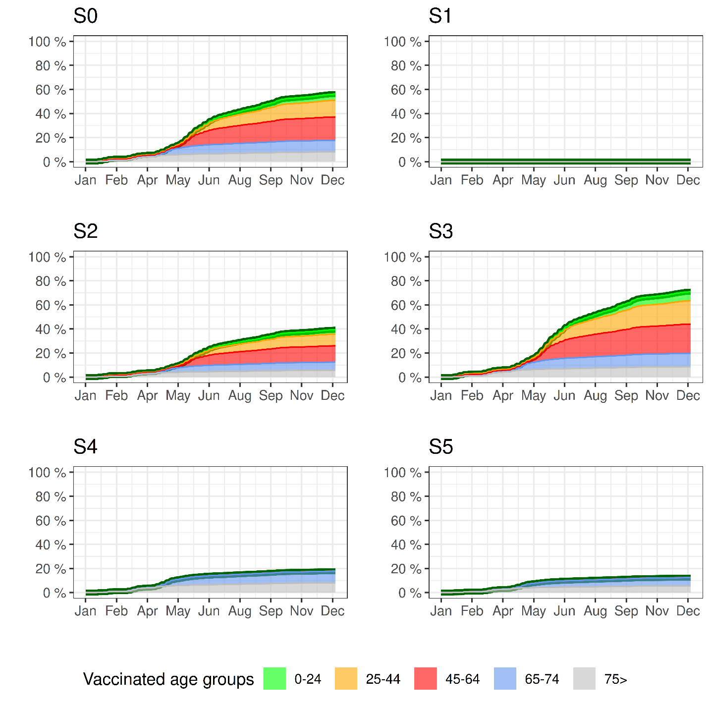
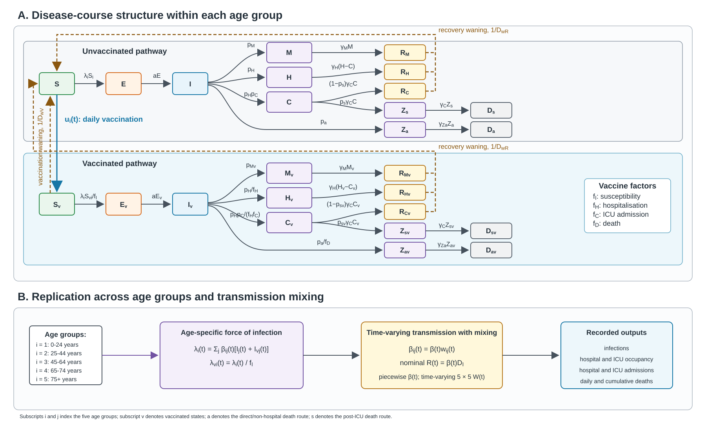

# COVID-19 Vaccination Scenario Analysis in Slovenia

This repository contains the data-processing, modelling, calibration, uncertainty-analysis, plotting, and tabulation code for a retrospective counterfactual study of Slovenia's COVID-19 vaccination programme from 1 January to 31 December 2021.

The study compares the observed vaccination rollout with five alternative rollout scenarios using an extended age-stratified SEIR model. The scientific description below synthesizes the study methodology, with implementation details checked against the R code in this repository.

## Study Design and Data

The analysis uses anonymised aggregate national time series of laboratory-confirmed SARS-CoV-2 infections, COVID-19-related deaths, hospital occupancy, ICU occupancy, and vaccination uptake. The source documents identify the Slovenian National Institute of Public Health, the Slovenian open-data portal OPSI, official national reports, and COVID-19 Sledilnik as the principal data sources.

The national case definition included PCR- or rapid-antigen-confirmed infections from 1 January to 12 March 2021 and PCR-confirmed infections from 13 March to 31 December 2021. COVID-19-related deaths were deaths for which confirmed COVID-19 infection was recorded as the underlying cause. COVID-19 hospital and ICU data were collected from Slovenian hospitals through national healthcare-capacity surveillance.

The model divides the population into five age groups:

- 0-24 years
- 25-44 years
- 45-64 years
- 65-74 years
- 75 years and older

Age-specific vaccination uptake is derived from cumulative second-dose counts. The reported age bands are aggregated into the five model groups, differenced into daily increments, and converted into population-share flows.

The repository includes these input files:

| File | Role in the analysis |
|---|---|
| `data/slo-covid-19_stats.csv` | Confirmed cases, hospital and ICU occupancy, cumulative deaths, and vaccination totals |
| `data/nijz_vw_lusy_okuzeni.csv` | NIJZ mortality series used to construct daily and cumulative deaths |
| `data/sledilnik_vaccination-by_age.csv` | Age-specific cumulative first- and second-dose counts |
| `data/population_shares.csv` | Population counts used to construct the five age groups |

In `model_data.R`, the first four tracker rows are discarded, NIJZ deaths are matched by date, unmatched death dates are assigned zero, and cumulative deaths are rebuilt. Missing cumulative vaccination entries are replaced with zero before differencing. In the ODE, negative vaccination flows are clamped to zero and vaccination cannot exceed the susceptible population available in the corresponding age group.

## Analytical Workflow

The study uses a three-phase workflow. All counterfactuals start from one common representation of Slovenia's 2021 epidemic and are not independently fitted to observed outcomes.



### Phase 1: transmission optimization

The epidemic is simulated from its start in Slovenia in 2020 so that infection, immunity, and vaccination history determine the model state entering 2021. Transmission is represented by 47 piecewise-constant beta coefficients over irregular time windows. The initial values are specified on a nominal reproduction-number scale and divided by the infectious duration before use as beta coefficients.

`run_Bw_optimization.R` optimizes coefficients 17-47, corresponding to 31 coefficients associated with the 2021 fitting period. The earlier 16 coefficients remain fixed to preserve the pre-2021 epidemic history. Optimization covers 1 January-31 December 2021 and uses bounded L-BFGS-B through `stats::optim`.

For each candidate transmission trajectory, model outputs are summed over the five age groups. The objective is a weighted sum of normalized root-mean-square errors:

| Outcome | Objective weight |
|---|---:|
| Confirmed infections | 0.5 |
| Hospital occupancy | 1.0 |
| ICU occupancy | 1.0 |
| Daily deaths | 1.0 |

The lower infection weight reflects greater variability and changes in testing and case ascertainment. Calibration is disabled during optimization. The code uses a default beta lower bound of `1e-6`, an upper bound of ten times the largest initial beta, and `maxit = 10`. The optimized trajectory and metadata are saved to `Bw_optimization.RData`.

### Phase 2: empirical calibration of S0

The optimized observed-rollout trajectory is calibrated sequentially to:

1. Hospital occupancy
2. ICU occupancy
3. Confirmed infections
4. Daily deaths

Each correction starts from the ratio of the observed series to the sum of the five modelled age-group series plus one. Ratios are smoothed with centered moving averages, missing values are interpolated with `imputeTS::na_interpolation`, and corrections are constrained to the interval 0.85-1.15.

| Calibration target | Centered smoothing window | Application |
|---|---:|---|
| Hospital occupancy | 14 days | Multiplies age-specific hospitalisation probabilities, then reruns the model |
| ICU occupancy | 20 days | Multiplies age-specific ICU probabilities, then reruns the model |
| Confirmed infections | 10 days | Corrects infection output directly |
| Daily deaths | 20 days | Corrects daily-death output directly and rebuilds cumulative deaths |

The same correction is applied to all age groups, preserving the modelled age distribution. These S0 correction trajectories are transferred unchanged to every counterfactual simulation.

Before empirical calibration, modelled daily infections are multiplied by a fixed ascertainment weight of 0.4 throughout the 870-day simulation.

### Phase 3: counterfactual scenarios

Each counterfactual replaces only the vaccination functions used by its parameter object while retaining the optimized transmission trajectory and S0 calibration corrections. The manuscript scenario definitions are:

| Scenario | Vaccination trajectory | End-of-2021 overall coverage |
|---|---|---:|
| S0 | Observed rollout | 56.1% |
| S1 | No vaccination | 0% |
| S2 | 0.7 times observed daily uptake in every age group | 39.3% |
| S3 | Increased age-specific uptake, approximately 1.3 times observed overall coverage | 70.9% |
| S4 | Observed uptake at age 65 and older; no uptake below age 65 | 17.7% |
| S5 | 0.7 times observed uptake at age 65 and older; no uptake below age 65 | 12.5% |

The full end-of-year coverage table is:

| Age group | S0 | S1 | S2 | S3 | S4 | S5 |
|---|---:|---:|---:|---:|---:|---:|
| 0-24 years | 21.1% | 0% | 14.8% | 30.6% | 0.0% | 0.0% |
| 25-44 years | 52.3% | 0% | 36.7% | 73.3% | 0.0% | 0.0% |
| 45-64 years | 68.3% | 0% | 47.8% | 85.3% | 0.0% | 0.0% |
| 65-74 years | 83.3% | 0% | 58.3% | 95.7% | 83.3% | 58.3% |
| 75 years and older | 89.0% | 0% | 62.4% | 95.8% | 89.0% | 62.4% |
| Overall | 56.1% | 0% | 39.3% | 70.9% | 17.7% | 12.5% |



The increased-uptake scenario uses factors of 1.45, 1.40, 1.25, 1.15, and 1.075 for the five age groups, respectively. The reduced-uptake scenario uses 0.7 in every age group. In the age-65-and-older scenarios, uptake below age 65 is multiplied by 0.001 rather than set to exact zero to maintain numerical stability with LSODA.

## Epidemiological Model

The implementation is a deterministic compartmental model extending the SEIR framework with age-specific transmission, vaccination, clinical progression, healthcare use, two death pathways, recovery, and waning immunity. It is solved with `deSolve::lsoda` using the package defaults.



### States and transitions

Within each age group, vaccinated and unvaccinated individuals follow parallel pathways. Principal states are susceptible `S`, exposed `E`, infectious `I`, mild or asymptomatic `M`, hospital occupancy `H`, ICU occupancy `C`, direct/non-hospital pre-death `Za`, post-ICU pre-death `Zs`, course-specific recovery states `RM`, `RH`, and `RC`, and terminal cumulative death states `Da` and `Ds`. Vaccinated states use the `v` suffix.

The complete ODE vector contains 170 states: 130 disease-course states and 40 auxiliary cumulative states used to record vaccination, infection incidence, hospital admissions, and ICU admissions.

The principal rates are:

```text
a        = 1 / D_E
gamma    = 1 / D_I
gamma_M  = 1 / D_M
gamma_H  = 1 / D_H
gamma_C  = 1 / D_C
gamma_Za = 1 / D_Za
w_R      = 1 / D_wR
w_V      = 1 / D_wV
```

The principal susceptible, exposed, and infectious equations are:

```text
dS_i/dt  = -lambda_i S_i - u_i
           + w_R (R_Mi + R_Hi + R_Ci + R_Mvi + R_Hvi + R_Cvi)
           + w_V S_vi

dE_i/dt  = lambda_i S_i - a E_i
dI_i/dt  = a E_i - gamma I_i

dS_vi/dt = u_i - w_V S_vi - lambda_vi S_vi
dE_vi/dt = lambda_vi S_vi - a E_vi
dI_vi/dt = a E_vi - gamma I_vi
```

At the end of infectiousness, individuals enter mild disease, hospital care, or the direct death pathway. For unvaccinated individuals, `p_Mi = 1 - p_Hi - p_ai`. The main clinical equations are:

```text
dM_i/dt = p_Mi gamma I_i - gamma_M M_i
dH_i/dt = p_Hi gamma I_i - gamma_H (H_i - C_i) - gamma_C C_i
dC_i/dt = p_Hi p_Ci gamma I_i - gamma_C C_i
```

Hospital occupancy includes ICU occupancy as a nested subset. Death can follow either `I -> Za -> Da` or `C -> Zs -> Ds`. Recovery after mild disease, non-ICU hospitalisation, and ICU care enters separate recovery states because the inflows originate from different clinical pathways, although all use the same waning rate.

### Age-specific transmission

The force of infection is:

```text
lambda_i(t)  = beta(t) sum_j w_ij(t) [I_j(t) + I_vj(t)]
lambda_vi(t) = lambda_i(t) / f_I
beta_ij(t)   = beta(t) w_ij(t)
R(t)         = beta(t) D_I
```

`W(t)` is a time-varying 5 x 5 mixing matrix. The code defines four fixed matrices and changes between them on 1 February 2021, 1 September 2021, and 10 October 2021. The scalar `R(t)` is the nominal transmission input scale; it is not a next-generation-matrix estimate of the instantaneous reproduction number.

Vaccinated and unvaccinated infectious individuals contribute equally to the force of infection. Vaccine protection against infection acts by reducing susceptibility, not infectiousness after breakthrough infection.

### Vaccination and vaccine protection

The vaccinated clinical probabilities are obtained by dividing the corresponding unvaccinated risks by vaccine-protection factors:

```text
p_Hvi = p_Hi / f_H
p_Cvi = p_Ci / f_C
p_avi = p_ai / f_D
p_svi = p_si / f_D
p_Mvi = 1 - p_Hvi - p_avi
```

Because ICU admission is conditional on hospitalisation, vaccination reduces ICU admission after infection through both `f_H` and `f_C`.

| Factor | Interpretation | Baseline value | Corresponding conditional risk ratio |
|---|---|---:|---:|
| `f_I` | Reduced susceptibility to infection | 5 | 0.20 |
| `f_H` | Reduced hospitalisation risk after infection | 10 | 0.10 |
| `f_C` | Reduced ICU risk after hospitalisation | 5 | 0.20 |
| `f_D` | Reduced risk on each death pathway | 10 | 0.10 |

The model does not distinguish first doses, boosters, vaccine products, or time since dose.

### Model parameters and initialization

| Parameter | Implementation value or treatment |
|---|---|
| Population `N` | 2,100,000 |
| Initial exposed population | 25, allocated as five exposed people per age group |
| Simulation duration | 870 daily time points |
| Exposed duration `D_E` | 5.2 days |
| Infectious duration `D_I` | 2.9 days |
| Mild-state duration `D_M` | 12 days |
| Non-ICU hospital duration `D_H` | 12 days |
| ICU duration `D_C` | 14 days |
| Direct and post-ICU pre-death duration | 14 days |
| Recovery-immunity waning `D_wR` | 365 days in the baseline parameter set |
| Vaccinated-state waning `D_wV` | 365 days in the baseline parameter set |
| Hospital temporal shift | 6 days earlier |
| ICU temporal shift | 5 days earlier |

Susceptible initial states follow the five population shares. Model dates are aligned by assigning 14 March 2020 to the first simulated date on which rounded cumulative deaths equal one. ODE compartment values are converted to persons and rounded to two decimal places before daily incidence is obtained by differencing.

Hospitalisation, ICU, direct-death, and post-ICU-death probabilities are age- and time-specific arrays defined in `model_parameters.R`. They are fixed baseline schedules except for the hospital and ICU calibration multipliers.

## Uncertainty Analysis

Each counterfactual scenario is run 500 times. In each simulation:

- All 47 transmission coefficients, including the 16 pre-2021 coefficients, are independently perturbed by a uniform relative amount between -10% and +10%.
- Perturbed beta coefficients are lower-bounded at 0.005.
- Each vaccine-protection factor is independently drawn with `max(1, rnorm(1, mean = baseline, sd = 2))`.
- The vaccination trajectory remains fixed at its scenario definition.
- Mixing matrices, baseline severity arrays, initial conditions, and S0 calibration corrections remain fixed.

The vaccine-factor operation is a lower-clamped normal draw rather than a truncated-normal draw: values below one are replaced by one. S0 is represented by one calibrated trajectory and receives degenerate interval columns equal to its point value.

For each date and outcome, the median is the point estimate and the 2.5th and 97.5th percentiles form the 95% uncertainty interval. For annual estimates, each complete simulation trajectory is aggregated first, after which quantiles are calculated across simulation-specific totals.

The script calls `set.seed(2505)` before creating PSOCK clusters, but it does not register a parallel reproducible-RNG backend. Exact uncertainty draws are therefore not guaranteed to repeat across parallel runs.

## Outcomes and Comparisons

Model output is aggregated for all ages and for people aged 65 years and older, with the latter combining the 65-74 and 75-and-older groups. The scenario objects retain:

- Daily infections
- Hospital and ICU occupancy
- Daily hospital and ICU admissions
- Daily and cumulative deaths

Vaccination counters exist in the raw per-age model output but are not retained by `combine_simulation_projections_over65()` in the saved scenario objects.

The analysis requests annual totals for 1 January-31 December 2021. For non-cumulative outcomes, the implementation sums the selected daily values and subtracts the first selected value. For cumulative outcomes it takes the last value minus the first. Thus, the code's annual incidence summaries effectively exclude the first selected day's contribution.

Rates per 100,000 divide totals by `21.01462765957446808510`, corresponding to an implied population of approximately 2,101,463, while the ODE population parameter is 2,100,000.

`table_scenario_results.R` reports `Sx / S0` as the relative ratio and calculates percentage difference as:

```text
(S0 - Sx) / S0 * 100
```

Positive percentages indicate fewer outcomes than S0 and negative percentages indicate more. This differs from the averted-outcome definition in the methodology text, which defines the averted number as `counterfactual - S0` and the proportion averted relative to the counterfactual total.

The S0-S1 comparison estimates the total effect of the observed vaccination programme relative to no vaccination. S0-S2 and S0-S3 compare lower and higher uptake. S0-S4 among people aged 65 and older estimates transmission-mediated protection associated with vaccinating people below age 65, conditional on model assumptions, because older-age coverage is unchanged between S0 and S4.

## Calibration Diagnostics

The generated evaluation includes RMSE, NRMSE, MAE, NMAE, and percent bias (PBIAS). NRMSE and NMAE use mean observed values as denominators. PBIAS is calculated as `100 * sum(modelled - observed) / sum(observed)`, so positive values indicate overestimation and negative values underestimation. Mortality diagnostics compare modelled deaths with a centered seven-day mean of observed deaths.

The methodology reports these S0 diagnostics:

| Outcome | MAE after optimization | NMAE after optimization | MAE after calibration | NMAE after calibration |
|---|---:|---:|---:|---:|
| Hospital occupancy | 23.89 patients | 4.63% | 15.66 patients | 3.04% |
| ICU occupancy | 5.97 patients | 5.18% | 4.63 patients | 4.02% |
| Daily deaths | 2.00 deaths/day | 24.06% | 1.40 deaths/day | 16.85% |

Calibration improves numerical agreement without changing the broad timing of the epidemic waves established by the optimized transmission trajectory.

## Implementation Notes

The manuscript uses scenario labels S0-S5, while the R objects retain historical internal numbering. The correct mapping is:

| Manuscript label | Parameter object | Result object | Meaning |
|---|---|---|---|
| S0 | `param` | `spdat_scen4` | Observed rollout |
| S1 | `scenario_parameters1` | `spdat_scen1` | No vaccination |
| S2 | `scenario_parameters3` | `spdat_scen3` | 0.7 times observed uptake |
| S3 | `scenario_parameters2` | `spdat_scen2` | Increased uptake |
| S4 | `scenario_parameters5` | `spdat_scen5` | Age 65 and older only, observed uptake |
| S5 | `scenario_parameters6` | `spdat_scen6` | Age 65 and older only, 0.7 times observed uptake |

`table_scenario_results.R` remaps these objects to manuscript labels. `plot_scenario_results.R` uses the historical internal labels instead, so its legends call increased uptake “S2,” reduced uptake “S3,” older-only uptake “S5,” and reduced older-only uptake “S6.”

The no-vaccination object changes only the vaccination trajectory. It retains the baseline `D_waning_R` and `D_waning_V` values of 365 days, matching the methodology's stated design in which counterfactuals change vaccination trajectories while retaining other assumptions.

## Software Requirements

The analysis requires R and these external packages:

```r
install.packages(c(
  "abind",
  "deSolve",
  "doParallel",
  "dplyr",
  "foreach",
  "ggplot2",
  "imputeTS",
  "plotly",
  "scales",
  "tidyr"
))
```

The main script uses all but two detected CPU cores:

```r
numCores = max(1, parallel::detectCores() - 2)
```

Optimization and the 2,500 counterfactual runs are computationally intensive.

## Running the Analysis

Run both entry points from the repository root. The scripts resolve inputs relative to `getwd()` and require write access to the repository root and `results/`.

1. Optimize the 2021 transmission parameters:

```bash
Rscript run_Bw_optimization.R
```

This creates `Bw_optimization.RData`. A precomputed copy is included in the repository.

2. Run S0 calibration, all counterfactual simulations, plots, and tables:

```bash
Rscript analysis_vaccination_scenarios.R
```

Set `produce_graphical_output = TRUE` near the start of `analysis_vaccination_scenarios.R` to print interactive plots during execution. Static plots are saved regardless of this setting.

## Outputs

The main analysis writes:

| Path | Contents |
|---|---|
| `scenario_simulation_data.RData` | Root-level S0 and counterfactual scenario objects |
| `results/optimization-fit.png` | Model fit after transmission optimization |
| `results/calibration-fit.png` | Model fit after empirical calibration |
| `results/optimization_and_calibration_evaluation.md` | Optimization and calibration error metrics |
| `results/hospital_occupancy_by_scenario.png` | Hospital-occupancy trajectories |
| `results/icu_occupancy_by_scenario.png` | ICU-occupancy trajectories |
| `results/daily_deaths_by_scenario.png` | Daily-death trajectories |
| `results/simulation_table_results.md` | Annual totals, rates, relative ratios, and percentage differences |

## Repository Structure

| Path | Purpose |
|---|---|
| `analysis_vaccination_scenarios.R` | Main calibration, uncertainty simulation, output, plot, and table workflow |
| `run_Bw_optimization.R` | Standalone transmission-optimization entry point |
| `model_functions.R` | ODE system, observation alignment, and calibration functions |
| `model_data.R` | Surveillance, mortality, population, and vaccination data preparation |
| `model_parameters.R` | Durations, vaccine factors, severity schedules, mixing matrices, and vaccination functions |
| `initial_bw_parameters.R` | Initial transmission coefficients and time windows |
| `optimization_functions.R` | Weighted objective and bounded L-BFGS-B implementation |
| `simulation_functions.R` | Scenario execution, aggregation, uncertainty intervals, and period totals |
| `model_error_metrics.R` | RMSE, NRMSE, MAE, NMAE, and PBIAS functions |
| `plot_calibration_results.R` | Optimization and calibration figures |
| `plot_scenario_results.R` | Scenario trajectory figures |
| `table_scenario_results.R` | Markdown scenario tables |
| `data/` | Included aggregate input data |
| `doc/` | Main and supplementary methodology plus manuscript figures |
| `results/` | Generated plots and Markdown tables |

## Interpretation and Limitations

Counterfactual estimates are conditional on the model structure, optimized transmission history, empirical calibration, age-mixing matrices, clinical-progression schedules, vaccine-effect assumptions, initial conditions, and prescribed vaccination trajectories. Counterfactual scenarios are not independently calibrated.

The model uses aggregate data and simplifies vaccination to a second-dose-derived flow into one vaccinated susceptible state. It does not distinguish vaccine products, doses beyond the second, or time since vaccination. Breakthrough infections are assumed to be as infectious as infections in unvaccinated people. The uncertainty analysis varies transmission and vaccine-protection factors but does not vary model structure, mixing matrices, clinical schedules, initial conditions, or calibration corrections.

## Ethics

Only anonymised, routinely collected aggregate surveillance data from public or official sources are used. No identifiable individual-level data or participant contact is involved. The methodology therefore states that ethical approval and informed consent were not required for this secondary analysis.

## Documentation and Figures

| File | Description |
|---|---|
| [`doc/flow-diagram.svg`](doc/flow-diagram.svg) | Scalable workflow diagram |
| [`doc/flow-diagram.png`](doc/flow-diagram.png) | Raster workflow diagram |
| [`doc/supplementary-model-structure.svg`](doc/supplementary-model-structure.svg) | Model structure and age mixing |
| [`doc/figure3-vaccination-scenarios.png`](doc/figure3-vaccination-scenarios.png) | Scenario-specific vaccination trajectories |

## References

1. Fošnarič, M., Kamenšek, T., Žganec Gros, J. & Žibert, J. Extended compartmental model for modeling COVID-19 epidemic in Slovenia. *Scientific Reports* **12**, 16916 (2022). https://doi.org/10.1038/s41598-022-21612-7.
2. Sherratt, K. et al. Predictive performance of multi-model ensemble forecasts of COVID-19 across European nations. *eLife* **12**, e81916 (2023). https://doi.org/10.7554/eLife.81916.
3. Prem, K., Cook, A. R. & Jit, M. Projecting social contact matrices in 152 countries using contact surveys and demographic data. *PLOS Computational Biology* **13**, e1005697 (2017). https://doi.org/10.1371/journal.pcbi.1005697.
4. Nacionalni inštitut za javno zdravje. OPSI - Odprti podatki Slovenije: Precepljenost proti COVID-19. https://podatki.gov.si/dataset/precepljenost-proti-covid19/resource/639e2e1a-7d4b-4b10-8cdc-f2f8b0258ea0 (2024).
5. Lauer, S. A. et al. The incubation period of coronavirus disease 2019 (COVID-19) from publicly reported confirmed cases: estimation and application. *Annals of Internal Medicine* **172**, 577-582 (2020). https://doi.org/10.7326/M20-0504.
6. Hogan, A. B. et al. Within-country age-based prioritisation, global allocation, and public health impact of a vaccine against SARS-CoV-2: a mathematical modelling analysis. *Vaccine* **39**, 2995-3006 (2021). https://doi.org/10.1016/j.vaccine.2021.04.002.
7. Linton, N. M. et al. Incubation period and other epidemiological characteristics of 2019 novel coronavirus infections with right truncation: a statistical analysis of publicly available case data. *Journal of Clinical Medicine* **9**, 538 (2020). https://doi.org/10.3390/jcm9020538.
8. Nacionalni inštitut za javno zdravje. OPSI - Odprti podatki Slovenije: Data from the National Institute of Public Health. https://podatki.gov.si/data/search?s=nijz.
9. COVID-19 Sledilnik. https://covid-19.sledilnik.org/.
10. European Centre for Disease Prevention and Control. Updated projections of COVID-19 in the EU/EEA and the UK (2020). https://www.ecdc.europa.eu/sites/default/files/documents/covid-forecasts-modelling-november-2020.pdf.
11. Zhang, J. et al. Changes in contact patterns shape the dynamics of the COVID-19 outbreak in China. *Science* **368**, 1481-1486 (2020). https://doi.org/10.1126/science.abb8001.
12. Eyre, D. W. et al. Effect of COVID-19 vaccination on transmission of Alpha and Delta variants. *New England Journal of Medicine* **386**, 744-756 (2022). https://doi.org/10.1056/NEJMoa2116597.
13. Link-Gelles, R. et al. Effectiveness of bivalent mRNA vaccines in preventing symptomatic SARS-CoV-2 infection - Increasing Community Access to Testing Program, United States, September-November 2022. *MMWR Morbidity and Mortality Weekly Report* **71**, 1526-1530 (2022). https://doi.org/10.15585/mmwr.mm7148e1.
14. Grgič Vitek, M. et al. Vaccine effectiveness against severe acute respiratory infections (SARI) COVID-19 hospitalisations estimated from real-world surveillance data, Slovenia, October 2021. *Eurosurveillance* **27**, 2101110 (2022). https://doi.org/10.2807/1560-7917.ES.2022.27.1.2101110.
15. Menegale, F. et al. Evaluation of waning of SARS-CoV-2 vaccine-induced immunity: a systematic review and meta-analysis. *JAMA Network Open* **6**, e2310650 (2023). https://doi.org/10.1001/jamanetworkopen.2023.10650.
16. Byrd, R. H., Lu, P., Nocedal, J. & Zhu, C. A limited memory algorithm for bound constrained optimization. *SIAM Journal on Scientific Computing* **16**, 1190-1208 (1995). https://doi.org/10.1137/0916069.
